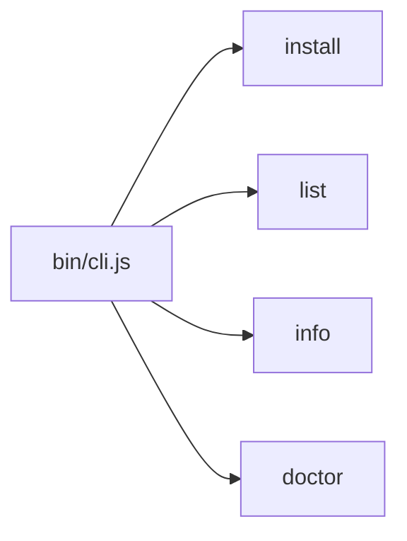

# Tarefa 2: Implementar CLI base com Commander

## Arquivos envolvidos

- [`bin/cli.js`](../../bin/cli.js) — criar do zero (entry point)
- [`package.json`](../../package.json) — já configurado com `bin` e `type: module` (sem alterações)

## Estrutura do `bin/cli.js`

```js
#!/usr/bin/env node
import { Command } from 'commander';
import chalk from 'chalk';

const program = new Command();

program
  .name('eufelipe-agent-skills')
  .description('CLI para instalar skills padronizadas em ferramentas de agentes')
  .version('1.0.0');

// 4 comandos com actions placeholder
program.command('install <skill>') // --target, --vault, --api-key, --with-mcp, --global
program.command('list')
program.command('info <skill>')
program.command('doctor')          // --target

program.parse();
```

## Fluxo de execução



## Notas

- `bin/cli.js` é apenas roteamento — sem lógica de negócio
- Actions usam `chalk.yellow('Comando X em desenvolvimento...')` como placeholder
- Cada comando terá seu próprio arquivo em `src/commands/` nas tarefas seguintes
- Subtarefas 2.1 e 2.5 do Taskmaster são redundantes (dependências e `package.json` já prontos desde Tarefa 1)
